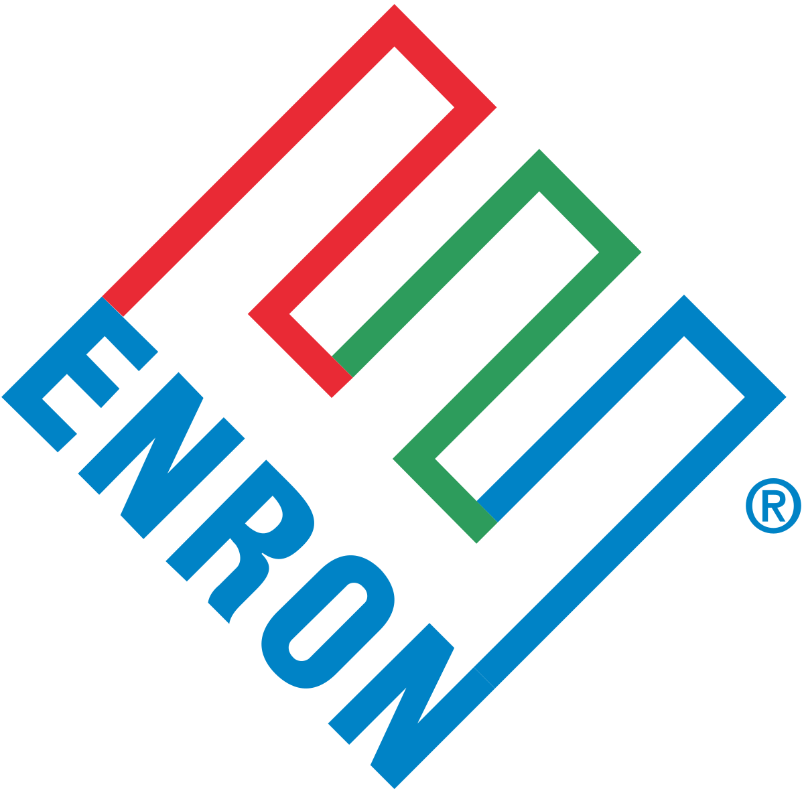

# Elratio
<a href="">

</a>

A Python-based programming language that combines the performance of Ruby with the readability of Perl.

> "The solution to Assembly"

To write your own Elratio program, download [template.py](template.py) and write your program in the indicated space.

# Features
Elratio provides numerous advantages over Python!

## Improved printing syntax
Python uses the unclear syntax `print()` to print. Elratio uses `systemOutPrint()` for clarity.
<pre>
print(10) // returns "I am a compiler of principle. I do not accept print(). Use systemOutPrint() instead."
</pre>
```python
systemOutPrint(10) // returns 10
```

You can thank Java for inspiring this change.

# Sponsors 💸💰🤑
  

# License
Elratio is under the GPL 3.0 license, meaning every Elratio program is required to be open source. By having an Elratio program on your computer without a freely available mirror online you are violating this license. Do not make us resort to violence.
